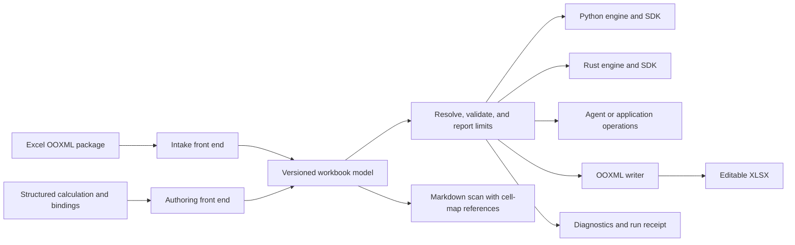

# Compiler pipeline and shared model contract

This is the engineering companion to [Workbook Forge product specifications](../product-specifications.md)
and the [North Star](../vision.md). It describes the intended compiler shape;
it does not claim every stage is integrated or Excel-compatible today.

## Decision

Workbook Forge is one compiler with multiple ways in and multiple targets. Every
supported path passes through the versioned canonical workbook model. The model
is the shared, typed description of workbook meaning that Python, Rust,
headless tools, and future application shells can read. It is not a second
spreadsheet file format and does not replace the OOXML package when unsupported
parts need to be preserved.

The three product directions are:

| Direction | Source | Shared step | Target | User result |
| --- | --- | --- | --- | --- |
| Excel into software | `.xlsx` package and its OOXML parts | Intake creates the versioned workbook model and source-linked observations | Python or Rust calculation, a bounded agent operation, or application code | Spreadsheet structure and supported calculations become inspectable and reusable |
| Code across runtimes | A supported structured calculation, workbook model, and explicit bindings | The same canonical bytes hydrate into each backend's native types | Independent Python and Rust engines and libraries | One authored calculation can run in different applications without a second definition |
| Software back to Excel | Canonical model plus an explicit edit or calculation result | Validation and lowering through the workbook model | Editable `.xlsx` package | People can continue using the result in Excel, with a record of what was checked |

The code-to-code promise is **shared meaning across supported runtimes**. It is
not a promise to translate arbitrary Python source into Rust or arbitrary Rust
source into Python. A supported calculation is represented by the canonical
model and declared operations; each engine implements that contract
independently. A future source-code generator needs its own language subset,
safety rules, and acceptance tests before it becomes a supported target.

When we say “code to XML,” the actual target is an `.xlsx` OOXML package: a ZIP
container with related XML parts, relationships, content types and sometimes
binary parts. Writing a formula into one worksheet XML document is not a full
workbook export; the package must remain internally consistent and open in
Excel.

## How adjacent spreadsheet tools fit

These tools cover useful neighboring layers. Workbook Forge should learn from
their boundaries without combining them into a bundle of unrelated engines or
claiming to replace them.

| Tool | Documented strength | Difference from the Workbook Forge goal |
| --- | --- | --- |
| [OpenPyXL](https://openpyxl.readthedocs.io/en/stable/index.html) | Python library for reading and writing OOXML workbooks. [`data_only`](https://openpyxl.readthedocs.io/en/stable/api/openpyxl.reader.excel.html) exposes either formula text or the value last stored by Excel; its [formula tools](https://openpyxl.readthedocs.io/en/stable/formula.html) provide limited parsing, tokenizing and translation. | It is useful for Python workbook editing and package-level tasks. Workbook Forge adds a versioned cross-language model, independent Python/Rust calculation, agent/application operations, and evidence that distinguishes imported caches from fresh results. OpenPyXL is not a recalculation oracle. |
| [HyperFormula](https://hyperformula.handsontable.com/docs/) | Headless TypeScript formula parser and evaluator with a [dependency graph](https://hyperformula.handsontable.com/docs/guide/dependency-graph.html) and spreadsheet operations for applications. | It is useful as a calculation layer inside a JavaScript application. Its [documented XLSX import](https://hyperformula.handsontable.com/docs/guide/file-import.html) uses a third-party workbook parser, then passes cell data as JavaScript arrays. The docs also describe an [MCP server preview](https://hyperformula.handsontable.com/docs/guide/mcp-server.html), marked unavailable as of this review. Workbook Forge's goal includes preserving a package-aware, versioned workbook model through Python and Rust as well as outputting editable OOXML. |
| **Workbook Forge** | Intended end-to-end compiler: Excel package or structured calculation → one versioned model → Python/Rust, agent or app operations → editable `.xlsx`, with diagnostics and receipts. | Its product claim depends on the joined path and Excel evidence. The full open/edit/recalculate/save/reimport gate remains outstanding, so this is the target boundary, not a claim that Forge currently outperforms these tools. |

The useful comparison is the layer each tool owns, not a feature-count contest.
OpenPyXL can solve Python file manipulation; HyperFormula can solve headless
JavaScript calculation. Workbook Forge is meant to make workbook meaning
portable across runtimes and return it to Excel with an auditable account of
what was preserved, calculated or refused. A future application may choose to
use such tools at a boundary, but that choice does not change the canonical
model or make them required dependencies.

The official docs reviewed on 2026-10-01 identify OpenPyXL 3.1.3 and
HyperFormula 3.4.0. HyperFormula documents GPLv3 or commercial licensing; under
the current permissive-only policy in `catalog/open_source_patterns.json`, it
is a product and architecture reference, not an eligible source for adapted
code. Refresh versions, capabilities and license terms before any dependency
decision.

## Concrete use cases for the shared pipeline

| User task | Entry | Compiler result | Why it is useful |
| --- | --- | --- | --- |
| “What is this workbook, and what drives this output?” | An `.xlsx` file and a named output | Versioned cell map, Markdown scan, formula/dependency path, evidence locations and limits | An agent can give a quick overview, then answer a focused question without treating a text dump as truth |
| “Run this calculation in my Python or Rust application.” | Canonical model and explicit named input/output bindings | Same calculation result and source trace from either independent engine | The app reuses calculation behavior without copying spreadsheet formulas into two separate codebases |
| “Change this assumption and give me a workbook I can keep editing.” | Model, proposed input change and explicit output path | Before/after preview, calculated result, new OOXML package and a comparison receipt | A person can review the effect and continue in Excel |
| “These results are hard-coded; what relationships might explain them?” | A read-only model plus labels, layout and repeated cases | Separate candidate formulas with evidence, ambiguity and counterexamples | An analyst can investigate without replacing source values or pretending the original formula is known |
| “I want an Excel-like front end for my own application.” | Rust or Python library plus the model and operation contracts | App-owned UI over the same validation, calculation and export operations | A custom UI can grow without first rebuilding formula evaluation and file handling |

## Terms used in this spec

- **Front end:** a reader or authoring surface that turns its input into the
  shared workbook model. The Excel reader and a supported structured
  calculation are different front ends.
- **Intermediate representation (IR):** the canonical workbook model between
  front ends and targets. Python and Rust hydrate the same serialized
  document into their own types; no live object crosses the language boundary.
- **Lowering:** converting a validated model operation into behavior provided
  by a target engine or into OOXML parts. Lowering must preserve supported
  meaning or report the limit.
- **Compilation receipt:** a machine-readable record tying the input, model
  revision, backend, stage outcomes, diagnostics, output artifacts, and any
  compatibility observation together. It supplements the model; it does not
  become another workbook store.
- **Semantic diff:** a comparison of workbook identities, formulas, bindings,
  supported metadata and calculated results. It does not require byte-for-byte
  identical ZIP packaging.

## Compiler stages and boundaries

Stages may share code internally, but each stage has a defined result and a
defined refusal boundary.

| Stage | Reads | Produces | Contract |
| --- | --- | --- | --- |
| 1. Preflight | Caller-selected file and resource policy | Package and format findings | Bound compressed and expanded size, reject malformed packages, and never execute macros or fetch external data |
| 2. Intake | OOXML workbook parts | Canonical model, original formulas and values, source locations, and `not_carried` findings | Coordinates and imported cached values remain distinct; unknown or unsupported content is named, preserved where supported, or refused |
| 3. Context views | The same model revision as intake | Markdown scan, region hints, and optional observer results | A preview points back to sheet/cell identities. It may help find meaning but cannot replace or rewrite the cell map |
| 4. Resolve and bind | Formulas, references, names, and explicit application bindings | Resolved dependency links and validated named inputs/outputs | Cell relationships are checked from workbook structure. Business names are explicit bindings, not guesses from labels or colors |
| 5. Validate | Model plus selected backend/profile | A validation result and typed diagnostics | Schema/version, reference, cycle, shape, type, and resource limits are checked before writes; unsupported calculations do not become approximations |
| 6. Calculate | A committed model snapshot and explicit inputs | New model values or a calculation result with provenance | Imported cached results never count as values calculated by Forge. Results name the engine, behavior profile, model revision, and relevant source cells |
| 7. Lower and emit | A validated model and target | Python/Rust operation result or an OOXML workbook | Runtime APIs operate on native model types. OOXML output is written to an explicit destination; unsupported edits are refused or described in a loss report |
| 8. Verify | Input and output artifacts plus the chosen oracle | Semantic diff and compilation receipt | Schema checks, independent-engine comparisons, SDK reimport, and Excel Desktop observation are separate evidence levels |

The common path is:

`input → preflight → intake/author → canonical model → resolve/bind → validate → calculate → lower/emit → verify`

Not every request needs every stage. A read-only intake can stop after the
model, preview and diagnostics. An authoring request can start from a structured
definition. A formula hypothesis pass is optional and never part of normal
compilation.

## Model and artifact invariants

1. **One workbook meaning.** All supported front ends and targets use the
   canonical schema in `schemas/`. Each schema change has an explicit
   `schema_version`; changes to interpretation use the `model_version` and
   changelog rules in [model versioning](model-versioning.md).
2. **Language independence.** Python and Rust deserialize the same bytes into
   native types and run their own implementations. FFI may optimize a call but
   is not the interchange contract. A third DTO between the canonical model
   and an engine is not allowed to own workbook meaning.
3. **Observed and inferred facts stay separate.** Original formula text,
   imported values, calculated values, author bindings, detected patterns and
   formula candidates have distinct labels and provenance. An imported Excel
   cache is never silently promoted to a Forge-calculated value.
4. **Location survives translation.** Every cell-level fact or diagnostic
   retains its sheet and address, plus a source package part when available.
   Formula dependencies retain the locations they resolve to.
5. **Unsupported content is accounted for.** Intake reports content the
   current model does not carry. An export either preserves the relevant
   package content, refuses a change that could invalidate it, or records the
   exact loss. A plain Markdown conversion or successful ZIP write is not a
   preservation guarantee.
6. **Snapshots and writes are bounded.** A calculation uses one committed
   model revision. A failure does not publish a partial result or output file.
   Mutations and exports use explicit destinations and revision checks where
   supported.
7. **No hidden semantic version.** The chosen backend and behavior profile are
   part of a result's evidence. Python/Rust agreement is a parity observation;
   it does not turn a Workbook Forge rule into an Excel rule.
8. **Privacy-safe source identity.** A resolved local path may be held in
   invocation-local file context when needed to read or safely patch a package;
   it is not canonical workbook meaning. New canonical writes omit `source_path`
   or set it to `null`, and imported-cell provenance records the import origin
   and package part rather than the resolved path. Run reports and receipts
   identify the exact input bytes with a content fingerprint. Summaries,
   Markdown, diagnostics, agent responses and receipts must not expose absolute
   paths by default. A caller may opt in to a safe display label; the raw
   filesystem path is never the label. Existing v1 documents that contain a
   path are redacted before they are summarized or returned to an agent;
   reserialization must not copy the old path forward.

The current v1 canonical schema intentionally has a narrower field set than
this long-term compiler target. If a requirement needs fields v1 cannot express,
record that gap and design a compatible schema change. Do not smuggle new
meaning into Markdown, an adapter DTO, a cache value, or an undocumented
`metadata` convention.

## Two views that cross-check one workbook

An Excel workbook has both a visual arrangement and a network of cell
relationships. A left-to-right text table may flatten two neighboring blocks,
lose whitespace boundaries, or make an unlabeled assumptions block look like
part of a report. Formula and dependency analysis can reveal that the block is
actually driving outputs.

For each intake revision:

1. Produce the coordinate-preserving cell map from the OOXML source.
2. Produce the readable preview from the same input fingerprint. Give each
   displayed region a link or coordinate range back to its source cells.
3. Let the preview raise questions about likely regions, headings, periods,
   units, or tables; check each question against coordinates, styles, formulas,
   named ranges, and dependency links.
4. Let structural evidence trigger a more focused preview or semantic note
   when the text view hid an important relationship.
5. Keep the proposed interpretation beside its evidence and confidence. Never
   replace the extracted cell facts with a generated summary.

This can run as a small headless orchestration: the structural reader and a
Markdown converter can work from the same file, then a reconciliation step
chooses whether a targeted cell-map query is needed. A Markdown-oriented tool
such as the AnyDoc pattern discussed during product planning is useful as a
context view; it is not the formula or workbook source of truth and does not
need to become a runtime dependency.

Optional metadata, pattern, semantic-tag and outlier observers attach findings
to the model/report without owning intake. They may be disabled or fail without
blocking the core cell map. Partitioning and parallel work should be added only
where dependency boundaries permit an independently verifiable result; one
workbook run must still reconcile into one model revision and one ordered
diagnostic set.

## What the agent and an application consume

The same typed operations should serve a command-line run, a JSON-lines agent,
Python application code, a Rust application, and a future spreadsheet-like UI.
The CLI is the pre-wired path; the SDK is the composable path. Both call the
same operation contracts, validation, calculation, diagnostics and revision
rules.

For example, a Tauri/Rust application can own its UI while importing the Rust
crate for model hydration and calculation. A Python service can use the Python
package. Neither application should need to implement Excel formula behavior,
model versioning, or OOXML preservation on its own. A UI can later choose how
to show cells and explanations, but it is a client of the model rather than the
place where calculation meaning is defined.

“Install and run” and “use it as a library” are two entry points to one
capability set. An operation description must say whether it reads, previews,
mutates or exports, along with its limits and the evidence it returns. Do not
build a full grid UI before the command and library workflows establish which
interactions are useful.

## Diagnostics, feature status, and receipts

The user-facing report must not collapse these claims into one `supported`
flag:

| Status | Meaning |
| --- | --- |
| Catalogued | A name or feature is indexed with source and status metadata |
| Captured | Its stored workbook text or package representation was read |
| Parsed | The current parser recognizes its syntax and produces a structured form |
| Evaluated | A named backend calculates a documented input domain |
| Cross-engine checked | Shared cases establish Python/Rust agreement for that domain |
| Emitted | The writer placed the supported model meaning into an `.xlsx` package |
| Excel observed | A specified Excel Desktop build opened, recalculated, saved, and was reimported |

A compilation receipt should at minimum identify the input by a content
fingerprint rather than exposing an absolute local path, record
`schema_version` and `model_version`, name the engine/profile and stage
outcomes, link diagnostics to source locations, identify output artifacts, and
summarize the semantic diff. Excel evidence additionally records the Excel
build, action sequence, calculation settings when available, and unavailable
observations. The exact receipt schema should be versioned when the first
integrated workflow is implemented, not invented separately by each CLI.

The privacy rule applies before serialization, not only when formatting a
receipt. The caller's resolved path belongs to short-lived invocation context;
canonical JSON omits it, while reports and receipts identify the input with a
content fingerprint and stable sheet, cell and OOXML-part locations. The
fingerprint belongs to the run/report linkage unless a future schema change
defines it as workbook-model data. Add an acceptance case whose input path
contains a distinctive private directory name, then verify that serialized
model bytes, summaries, Markdown, diagnostics, agent responses and receipts
omit that name while the report retains the fingerprint and cell-level
evidence. The current Python intake path does not meet this contract yet: its
workbook model and summary include the resolved source path, so close that gap
before making the joined-up agent workflow the default.

Each diagnostic should identify its stage, stable code, severity, affected
artifact/location, evidence, disposition and next useful action where known.
The current model's diagnostic schema is narrower; this requirement is a gap to
design deliberately, not a claim about today's JSON fields.

Round-trip evidence is layered:

1. The schema accepts the model.
2. Both independent engines return the shared expected calculation result.
3. The writer emits the intended formulas, bindings and supported package
   content.
4. SDK reimport finds the intended structure and results.
5. Excel Desktop opens, edits, fully recalculates, saves, and reimports the
   workbook; the receipt compares behavior as well as stored text and values.

Passing an earlier layer never implies a later one. A formula evaluator that
returns a rectangular array has not proven worksheet spill placement. A
preflight receipt has not shown that Excel opened the file.

## Formula mapping and candidate reconstruction

Formula coverage is selected by the workbook tasks it unlocks, not by adding
names to a catalog. For each proposed family, state the input patterns,
reference behavior, result shape, coercions, errors, resource bounds,
Python/Rust fixtures and Excel evidence level. Prioritize gaps that prevent a
whole workflow, such as formula-linked cell intake, named binding, dependency
explanation, or writing a declared result range.

Formula extraction and formula hypothesis generation are different passes:

- **Extraction** reports expressions actually stored in the source package,
  preserving exact text and cell location.
- **Hypothesis generation** examines hard-coded values, labels, units, repeated
  blocks, cross-sheet flow and stated relationships to suggest possible
  expressions. It evaluates candidates on a separate copy, reports matches and
  counterexamples, and leaves source cells untouched.

Finite hard-coded values often fit multiple formulas. A match is evidence for a
candidate, not proof of author intent. Reinstating a candidate requires a
separate explicit action and auditable diff. Research the false-positive rate
before showing one ranked answer as if it were certain.

## Research agenda

Study other projects to answer a specific question; do not combine their
architectures or copy code merely because they are adjacent to spreadsheets.
For each reference, record the question, observed mechanism and version/license
evidence, why it fits or does not fit Workbook Forge, and the adopt/adapt/reject
decision. Keep the source inventory in `catalog/open_source_patterns.json`.

| Research question | Why it matters | Useful output before implementation |
| --- | --- | --- |
| Which workbook details must the IR preserve to support reliable edit and export? | Version 1 reports many workbook parts as not carried; not every part is equally important to every task | A task-to-OOXML-part matrix with preserve, interpret, block, or defer decisions |
| How should formula text, parsed references, dependency links, cached results and calculated results relate? | Mixing these states creates false explanations and unsafe rewrites | A small semantic contract and counterexample fixtures, including shared formulas, names, arrays and error cells |
| What is the smallest shared calculation language that can lower to Python and Rust? | Native compositions and workbook formulas are separate authoring paths today | A supported operation table with typed inputs/outputs, lowering rules and refusal cases |
| Which patterns make the Markdown preview misrepresent worksheet meaning? | Visual adjacency, blanks, merged areas and formula flow can contradict a flat table | Synthetic workbooks with ground-truth regions and automated cross-view checks |
| Which formulas unlock complete user tasks? | Formula counts do not show whether users can finish a workflow | A ranked task-to-gap matrix with shared cases, required structural support and Excel-oracle cost |
| Can hard-coded formulas be suggested without misleading users? | One snapshot may underdetermine the original relationship | Ground-truth and ambiguous corpora, precision/recall results, counterexamples and a threshold recommendation |
| When does partitioned intake beat a simple bounded pass? | Parallelism adds merge and ordering complexity and cannot cross dependencies blindly | Benchmarks by workbook size, independent-region shape, memory and reconciliation cost |
| What makes an embedded Rust or Python application simple to build? | The long-term goal includes custom spreadsheet-like applications, not only agent tools | A clean consumer example using only the public library contract, followed by an explicit missing-capability list |

The open-source comparisons already recorded in the repository are evidence
sources, not a dependency roadmap. In particular, a Markdown converter can
inform the human scan layer while OOXML readers and formula engines answer
different questions about coordinates, formulas, cached values and results.

## Execution order

1. **Close one shared calculation result contract.** Use the existing
   operating-scenario model and bindings; pass the same canonical bytes to
   Python and Rust; return the same outputs with backend, model revision,
   input provenance and diagnostics. Do not author a second calculation for
   the test.
2. **Record the first scalar Excel observation.** Use the existing receipt
   harness to open, edit an input, force full recalculation, save, close and
   reimport. Commit an honest receipt, including settings the harness cannot
   observe. This is the first observation, not completion of Spec 2.
3. **Close the full Excel export gate before the joined agent path.** Add the
   declared output-range contract and spill placement, then run the required
   volatile, iterative, array/spill and known-quirk cases through Excel
   export/reimport with explicit comparison tolerances. If a required class is
   still unsupported, report that fact and keep the gate open.
4. **Prototype paired intake views in parallel with 1–3.** Create a
   coordinate-preserving cell map and a readable Markdown scan from the same
   workbook revision, then check each view against the other. Test weak labels,
   neighboring tables, blank gaps, layout and formula-driven assumptions.
   Enforce the privacy-safe source identity rule before serializing either
   view.
5. **Join the proven path behind one headless workflow.** After 1–4, read a
   workbook, emit its versioned model and paired scan/report, bind or inspect a
   declared calculation, calculate with a selected backend, export a new
   `.xlsx`, and print the receipt. Keep the CLI thin over library operations.
6. **Prove application reuse.** Build a small consumer outside the repository
   using the Python package and another using the Rust crate. Keep any UI shell
   separate from formula and workbook semantics.
7. **Expand formula families from observed gaps.** Add formula support only
   when it completes a named user task and its semantics are testable in both
   languages.
8. **Research candidate formula reconstruction.** Keep it separate from the
   trusted compiler path until ambiguous and incorrect hypotheses are measured.

The trust path is **shared calculation report → scalar Excel observation →
full Spec 2 evidence → headless workflow**. The paired-view prototype and
formula-gap research can advance alongside the Excel work, but the default
agent flow waits for the full gate and uses privacy-safe, source-linked
reports. Application embedding follows the same library operations rather
than creating a second calculation path.

## Scope limits

- This spec does not promise complete Excel 365 support.
- It does not define arbitrary source-code transpilation or execute imported
  macros, external links, or arbitrary formulas from a generated language.
- It does not make Markdown the workbook model, a database, a sealed event log,
  or a second source of truth.
- It does not require a user interface, a hosted service, collaborative
  editing, or a new repository to prove the v1 compiler path.
- It does not claim a hard-coded result reveals one original formula.
- It does not change the current schema. Any missing model meaning goes through
  the versioning and changelog process.
